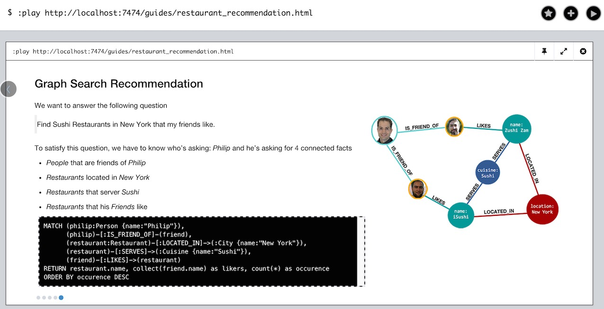

== Neo4j Server Extension for Serving Browser Guides

This is an a simple extension for http://neo4j.com/download[Neo4j Server] that can serve html content from a pre-configured directory.

This can be used for small, self-containted demos or Neo4j Browser Guides.

=== The Demo: Neo4j-Guides

As my demo I provide a setup that exposes HTML files for a Neo4j-Guide from a configured directory.

The `StaticWebResource` provides the web-files of the visualization from the `resources/webapp` directory.

*Note that you have to disable auth for this demo as I haven't added means for it to retrieve a username/password.*

You can use the demo by cloning and building (`mvn clean install`) this repository.
And then copy the resulting jar in the server's plugin directory.
And edit `neo4j-server.properties` to register the package name with an endpoint.

.For Neo4j 2.3
[source]
----
cp target/neo4j-guide-extension-2.3.2.jar $NEO4J_HOME/plugins/
echo 'org.neo4j.server.thirdparty_jaxrs_classes=extension.web=/guides' >>  $NEO4J_HOME/conf/neo4j-server.properties
echo 'org.neo4j.server.guide.directory=data/guides' >> $NEO4J_HOME/conf/neo4j-server.properties
$NEO4J_HOME/bin/neo4j restart

:play http://localhost:7474/guides/test.html
----

.For Neo4j 3.x
[source]
----
cp target/neo4j-guide-extension-2.3.2.jar $NEO4J_HOME/plugins/
echo 'dbms.unmanaged_extension_classes=extension.web=/guides' >>  $NEO4J_HOME/conf/neo4j-server.conf
echo 'org.neo4j.server.guide.directory=data/guides' >> $NEO4J_HOME/conf/neo4j-server.conf
$NEO4J_HOME/bin/neo4j restart

:play http://localhost:7474/guides/test.html
----

.This shows the restaurant-recommendation-graphgist running inside the Neo4j-Browser

You can also download https://dl.dropboxusercontent.com/u/14493611/neo4j-guide-extension-2.3.2.jar[the 2.3.2 JAR from here].

=== How does it work?

It is actually quite simple.
This is the core idea of exposing static web resources under the mountpoint.

[source,java]
----
@GET
@Path("{file:(?i).+\\.(png|jpg|jpeg|svg|gif|html?|js|css|txt|grass)}")
public Response file(@PathParam("file") String file) throws IOException {
    InputStream fileStream = findFileStream(file);
    if (fileStream == null) return Response.status(Response.Status.NOT_FOUND).build();
    else return Response.ok(fileStream, mediaType(file)).build();
}
----
